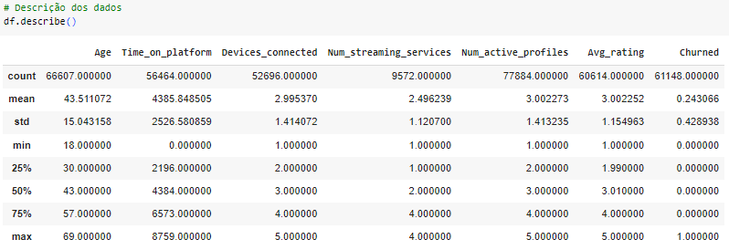

# Preveja os usuários com alta chance de deixar a plataforma de Streaming
 Análise de churn dos usuários 

> Utilize um modelo de classificação para mapear qual o perfil de usuários tem mais chance de deixar sua plataforma de streaming. Compreender quem é o perfil que está aumentando o churn do seu negócio é essencial para tomar ações que reduzam essas perdas, seja alterando critérios na venda ou modificando o produto.

## 1. Contexto

Você trabalha em uma plataforma de streaming e a diretoria está preocupada com o
alto índice de usuários cancelando as suas assinaturas. Eles acreditam que é possível
prever se um usuário tem mais chance de deixar a plataforma antes que isso aconteça,
e com base nessa informação tomar ações para reduzir o churn.
**Seu objetivo é criar um modelo de classificação capaz de prever se um usuário tem
mais chance de cancelar a sua assinatura na plataforma ou não.** Para isso, a empresa
forneceu uma base de dados em csv contendo dados sobre as contas dos clientes.

## 2. Sobre os dados
Uma adaptação do problema de ecommerce, disponível no **Kaggle.** Acesse [aqui](https://www.kaggle.com/datasets/ankitverma2010/ecommerce-customer-churn-analysis-and-prediction?select=E+Commerce+Dataset.xlsx).

**Base de dados em CSV utilizada para o desenvolvimento:** [Link](https://raw.githubusercontent.com/gcesarmelo7/python_classification_churn/main/database/streaming_data.csv)

Os dados fornecidos possuem informações sobre as contas dos clientes na plataforma
de streaming, divididos entre contas ***Basic, Standard e Premium,*** onde cada uma
oferece uma gama maior de serviços que a anterior.

Desenvolva um ***modelo de classificação que seja capaz de prever se o cliente irá
cancelar o serviço ou não,*** levando em consideração o seu perfil no streaming.
Teste com mais de um tipo de modelo para encontrar o que possuir a melhor
performance em comparação com um baseline. Utilize gráficos e visualizações para
auxiliar e enriquecer a sua análise.

## 3. Desenvolvimento

## 4. Modelagem

## 5. Conclusão

Dessa forma, com a utilização do algoritmo de Random Forest e com a tunagem, foi possível realizar a classificação dos usuários em churn ou não-churn obtendo-se uma melhor ideia dos potenciais resultados no futuro.

